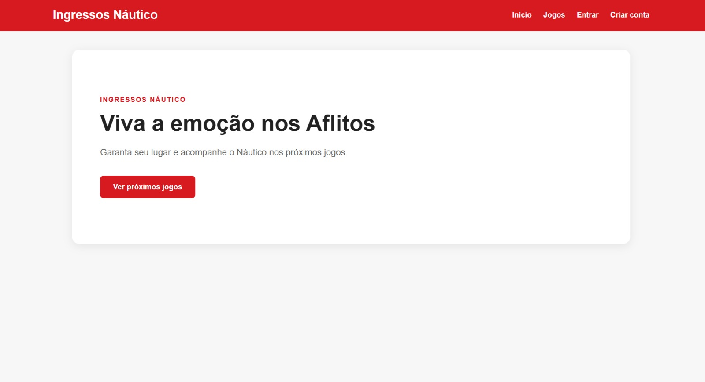
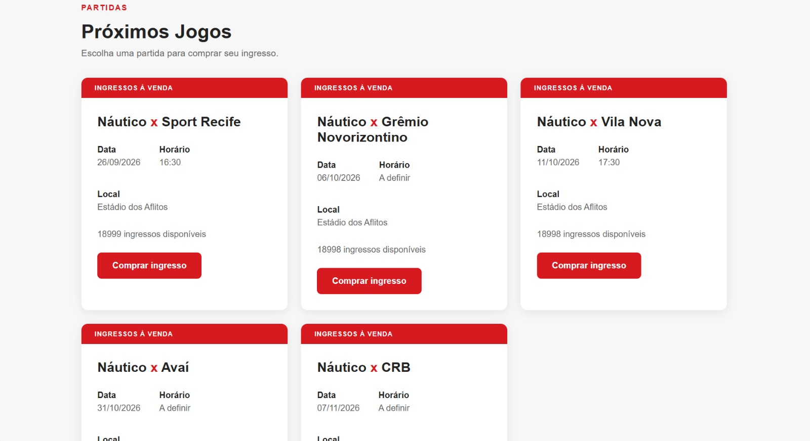
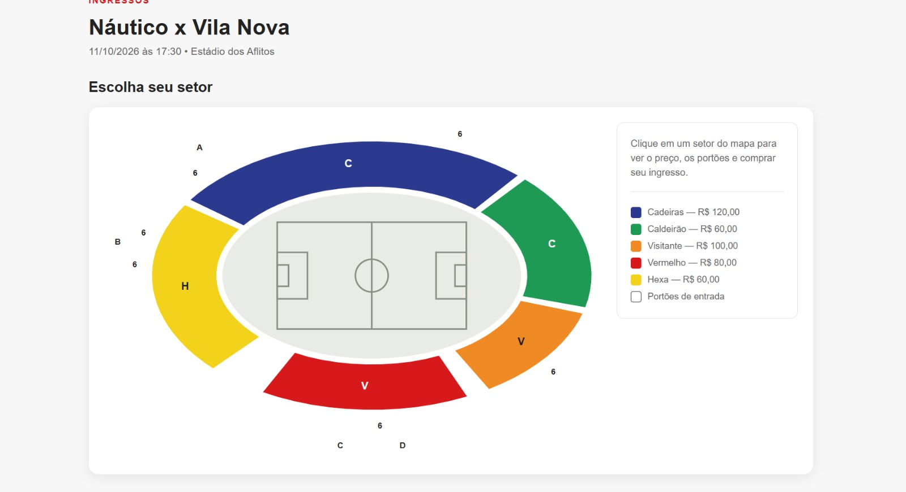
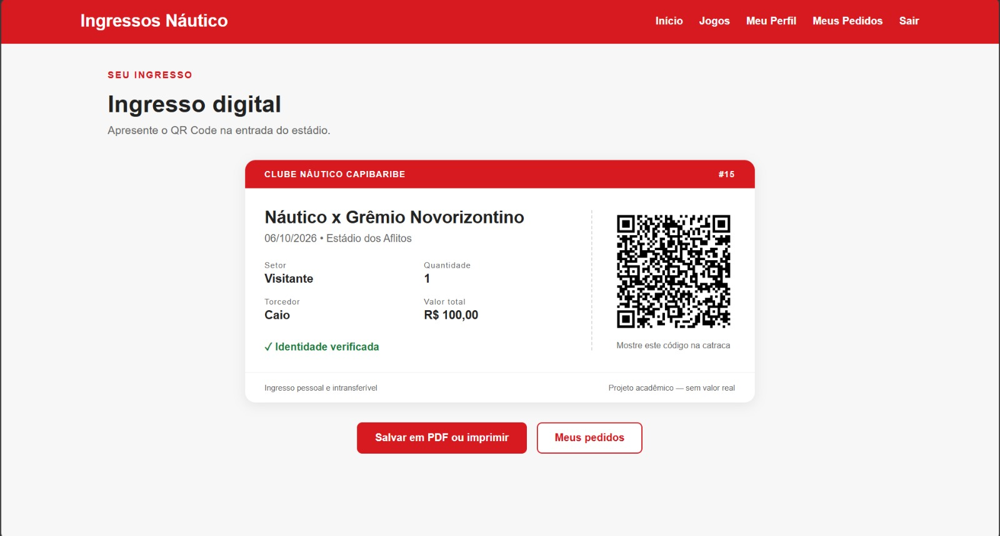

<p align="center">
  
</p>

<h1 align="center">🎟️ Náutico Ingressos</h1>

<p align="center">
  
  
  
  
  
  
</p>

Sistema web desenvolvido em Django para simular a compra de ingressos
para jogos do Clube Náutico Capibaribe.

> ⚠️ **Projeto acadêmico e de estudo.**
> Este sistema não possui vínculo oficial com o Clube Náutico Capibaribe
> e não realiza vendas nem pagamentos reais.

---

## 📋 Sumário

- [Sobre o projeto](#-sobre-o-projeto)
- [Funcionalidades](#-funcionalidades)
- [Destaques técnicos](#-destaques-técnicos)
- [Fluxo da aplicação](#-fluxo-da-aplicação)
- [Tecnologias](#-tecnologias)
- [Modelagem do banco de dados](#-modelagem-do-banco-de-dados)
- [Pré-requisitos](#-pré-requisitos)
- [Como rodar o projeto](#-como-rodar-o-projeto)
- [Comandos úteis](#-comandos-úteis)
- [Estrutura de pastas](#-estrutura-de-pastas)
- [Segurança](#-segurança)
- [Capturas de tela](#-capturas-de-tela)
- [Vídeos](#-vídeos)
- [Deploy](#-deploy)
- [Próximos passos](#-próximos-passos)
- [Autores](#-autores)
- [Licença](#-licença)

---

## 💡 Sobre o projeto

O **Náutico Ingressos** é uma aplicação web que simula uma plataforma de
venda de ingressos para partidas de futebol nos Aflitos.

O torcedor cria uma conta, vê os próximos jogos, escolhe o setor em um
**mapa interativo do estádio**, define a quantidade, passa por uma
verificação de identidade simulada, escolhe a forma de pagamento e recebe
um **ingresso digital com QR Code**, que pode ser validado na portaria.

O projeto foi desenvolvido para praticar desenvolvimento web completo:
front-end, back-end, banco de dados relacional, autenticação, regras de
negócio, segurança e versionamento com Git.

---

## ✨ Funcionalidades

- [x] Cadastro e login de usuários
- [x] Perfil do usuário com edição de nome, sobrenome e e-mail
- [x] Validação de cadastro com e-mail obrigatório e único
- [x] Listagem dos jogos separada entre próximos e encerrados
- [x] Estados do jogo: à venda, esgotado e encerrado
- [x] Mapa interativo dos setores do estádio
- [x] Escolha de setor e quantidade de ingressos
- [x] Verificação facial simulada
- [x] Pagamento simulado (PIX, crédito e débito)
- [x] Controle de estoque de ingressos por setor
- [x] Histórico de compras do usuário
- [x] Ingresso digital com QR Code assinado
- [x] Página de validação do ingresso para a equipe do clube
- [x] Painel administrativo para cadastrar jogos e setores
- [x] Layout responsivo para celular
- [ ] Reconhecimento facial real na catraca
- [ ] Envio do ingresso por e-mail

---

## 🧩 Destaques técnicos

### Mapa interativo do estádio

Os setores são desenhados em **SVG gerado pelo próprio Django**, em
`ingressos/mapa_estadio.py`. Cada setor é um trecho de um anel oval,
definido por ângulo inicial e final, e os portões são posicionados pela
mesma conta de trigonometria. Ao clicar em um setor, o painel lateral
mostra o preço, os portões de entrada e o botão de compra.

Os setores são ligados ao desenho pelo nome, sem diferenciar maiúsculas
nem acentos. Setores sem estoque aparecem em cinza como esgotados.

### Ingresso com QR Code

O QR Code é gerado em `ingressos/ingresso_qr.py` e guarda o endereço de
validação do ingresso. O código é **assinado com a `SECRET_KEY`** do
projeto pelo módulo `django.core.signing`, o que impede que alguém
invente um ingresso válido, e tem prazo de validade.

Ao ler o QR, a equipe do clube abre uma página que mostra se o ingresso
é válido, junto com jogo, setor, quantidade e torcedor.

### Controle de estoque

A finalização da compra roda dentro de `transaction.atomic` com
`select_for_update`, travando a linha do setor durante a venda. Assim,
duas pessoas comprando ao mesmo tempo não conseguem levar o mesmo último
ingresso.

---

## 🔄 Fluxo da aplicação

```
Cadastro / Login
        ↓
Lista de jogos  ──────────────→  jogo encerrado ou esgotado: compra bloqueada
        ↓
Mapa dos setores do estádio
        ↓
Escolha da quantidade
        ↓
Resumo do pedido
        ↓
Verificação facial (simulada)
        ↓
Pagamento (PIX, crédito ou débito)
        ↓
Compra finalizada
        ↓
Ingresso digital com QR Code  ──→  validação na portaria
        ↓
Meus pedidos / Perfil
```

---

## 🛠️ Tecnologias

**Front-end**
- HTML5
- CSS3 (Grid, Flexbox e variáveis CSS)
- JavaScript
- SVG gerado no servidor

**Back-end**
- Python 3
- Django 6
- qrcode (geração do QR Code)

**Banco de dados**
- MySQL

**Ferramentas**
- Git e GitHub
- python-dotenv (configuração por variáveis de ambiente)

---

## 🗄️ Modelagem do banco de dados

```
Jogo
├── adversario     CharField
├── data           DateField
├── horario        TimeField (opcional)
└── estadio        CharField

Setor                      (vários por Jogo)
├── jogo           FK → Jogo
├── nome           CharField
├── preco          DecimalField
└── quantidade     PositiveIntegerField

Pedido                     (vários por Setor e por usuário)
├── usuario              FK → User
├── setor                FK → Setor
├── quantidade           PositiveIntegerField
├── valor_total          DecimalField
├── data_compra          DateTimeField
├── biometria_verificada BooleanField
├── forma_pagamento      pix | credito | debito
└── status_pagamento     pendente | pago
```

Os estados do jogo (`encerrado`, `esgotado`, `ingressos_disponiveis`) são
**propriedades calculadas** no `models.py`, e não colunas do banco.

---

## ✅ Pré-requisitos

- [Python 3.10+](https://www.python.org/downloads/)
- [MySQL 8+](https://dev.mysql.com/downloads/)
- [Git](https://git-scm.com/)

---

## 🚀 Como rodar o projeto

**1. Clone o repositório**

```bash
git clone https://github.com/mariaeugeniamoraes/ingressoCNC_.git
cd ingressoCNC_
```

**2. Crie e ative o ambiente virtual**

```bash
python -m venv venv

# Windows (PowerShell)
venv\Scripts\activate

# Linux / macOS
source venv/bin/activate
```

**3. Instale as dependências**

```bash
pip install -r requirements.txt
```

**4. Crie o banco de dados no MySQL**

```sql
CREATE DATABASE nautico_ingressos CHARACTER SET utf8mb4;
```

**5. Crie o arquivo `.env`** na raiz do projeto, ao lado do `manage.py`:

```env
DB_NAME=nautico_ingressos
DB_USER=seu_usuario
DB_PASSWORD=sua_senha
DB_HOST=localhost
DB_PORT=3306
```

> O `.env` está no `.gitignore` e **não deve ser enviado ao GitHub**,
> porque contém a senha do banco.

**6. Rode as migrações**

```bash
python manage.py migrate
```

**7. Crie um superusuário** para acessar o painel administrativo

```bash
python manage.py createsuperuser
```

**8. Popule o banco com jogos e setores**

```bash
python manage.py criar_jogos
python manage.py criar_setores 1
```

**9. Inicie o servidor**

```bash
python manage.py runserver
```

Acesse em **http://127.0.0.1:8000/** e o painel em
**http://127.0.0.1:8000/admin/**.

---

## 🧰 Comandos úteis

| Comando | O que faz |
|---|---|
| `python manage.py criar_jogos` | Cadastra os jogos do calendário |
| `python manage.py criar_setores <id_do_jogo>` | Cria Social, Hexa, Vermelho, Caldeirão e Visitante para um jogo |
| `python manage.py dumpdata ingressos --indent 2 > dados.json` | Exporta jogos, setores e pedidos |
| `python manage.py loaddata dados.json` | Importa esses dados em outra máquina |

Os preços e quantidades criados pelos comandos são valores de exemplo e
podem ser ajustados pelo painel administrativo.

---

## 📁 Estrutura de pastas

```
ingressoCNC_/
├── manage.py
├── requirements.txt
├── README.md
├── .env                          # local, fora do Git
├── config/                       # configurações do projeto
│   ├── settings.py
│   └── urls.py
├── docs/                         # imagens usadas no README
└── ingressos/                    # app principal
    ├── models.py                 # Jogo, Setor e Pedido
    ├── views.py                  # regras das páginas
    ├── forms.py                  # cadastro e edição de perfil
    ├── urls.py                   # rotas
    ├── admin.py
    ├── mapa_estadio.py           # desenho SVG dos setores
    ├── ingresso_qr.py            # geração e leitura do QR Code
    ├── management/commands/      # criar_jogos e criar_setores
    ├── migrations/
    ├── static/ingressos/css/
    │   ├── style.css
    │   ├── mapa.css
    │   ├── ingresso.css
    │   └── extras.css
    └── templates/ingressos/      # páginas HTML
```

---

## 🔒 Segurança

Medidas aplicadas no projeto:

- **Pedidos protegidos por dono:** trocar o id na URL do ingresso devolve
  "página não encontrada". Só o dono e a equipe do clube têm acesso.
- **Login obrigatório** em todas as etapas da compra, no perfil e nos
  pedidos.
- **Validação em todas as etapas:** jogo encerrado, setor esgotado e
  quantidade inválida são bloqueados em cada tela, e não só na primeira,
  já que o navegador pode pular telas pela URL.
- **Valores calculados no servidor:** o total nunca vem do formulário.
- **Limite de 6 ingressos por pedido.**
- **Redirecionamento seguro após o login:** o parâmetro `next` só aceita
  endereços do próprio site.
- **Proteção contra CSRF** nos formulários, com ``.
- **Senhas com hash** pelo sistema de autenticação do Django.
- **Credenciais fora do código**, lidas do `.env`.

Antes de publicar o site, ainda é preciso definir `DEBUG = False`,
preencher `ALLOWED_HOSTS` e mover a `SECRET_KEY` para o `.env`.

---

## 🖼️ Capturas de tela

| Página inicial | Lista de jogos |
|:---:|:---:|
|  |  |

| Mapa dos setores | Ingresso com QR Code |
|:---:|:---:|
|  |  |

> Salve os prints na pasta `docs/` com esses nomes para as imagens
> aparecerem aqui.

---

## 🎥 Vídeos

| Vídeo | Link |
|---|---|
| Apresentação do projeto | _adicionar link_ |
| Demonstração do sistema | _adicionar link_ |

---

## ☁️ Deploy

> _Seção a ser preenchida quando o sistema for publicado._

- **Plataforma:** _a definir_
- **Link do sistema:** _a definir_
- **Banco de dados:** _a definir_

Para publicar, é necessário hospedar também o banco de dados, já que o
MySQL local não fica acessível pela internet.

---

## 🔭 Próximos passos

- Reconhecimento facial real na catraca, com validação do ingresso
- Marcar o ingresso como utilizado após a primeira leitura do QR Code
- Integração com um gateway de pagamento em modo de teste
- Envio do ingresso por e-mail
- Testes automatizados
- Deploy da aplicação

---

## 👨‍💻 Autores

**Daniel Bezerra**
Estudante de Ciência da Computação na CESAR School

[](https://github.com/DanielBezerraCNC)
[](https://www.linkedin.com/in/danielsantanabezerra)

**Maria Eugênia Moraes**
Estudante de Ciência da Computação na CESAR School

[](https://github.com/mariaeugeniamoraes)
[](https://www.linkedin.com/in/maria-eugenia-moraes)

---

## 📄 Licença

Este projeto está sob a licença MIT. Veja o arquivo [LICENSE](LICENSE)
para mais detalhes.

---

<p align="center">Feito com ❤️ para o maior do mundo! 🐭🔴⚪</p>
